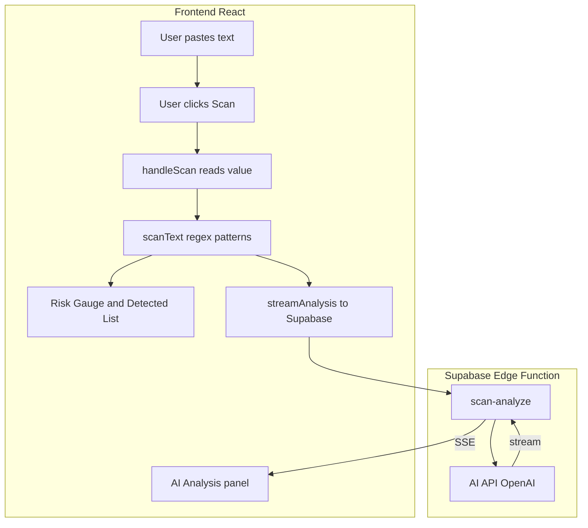
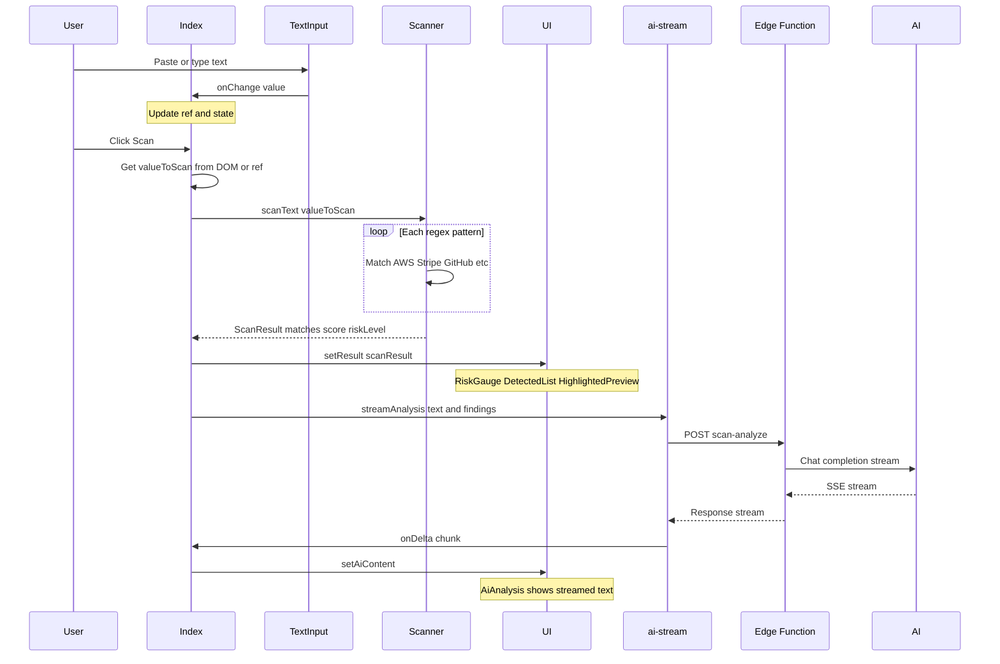
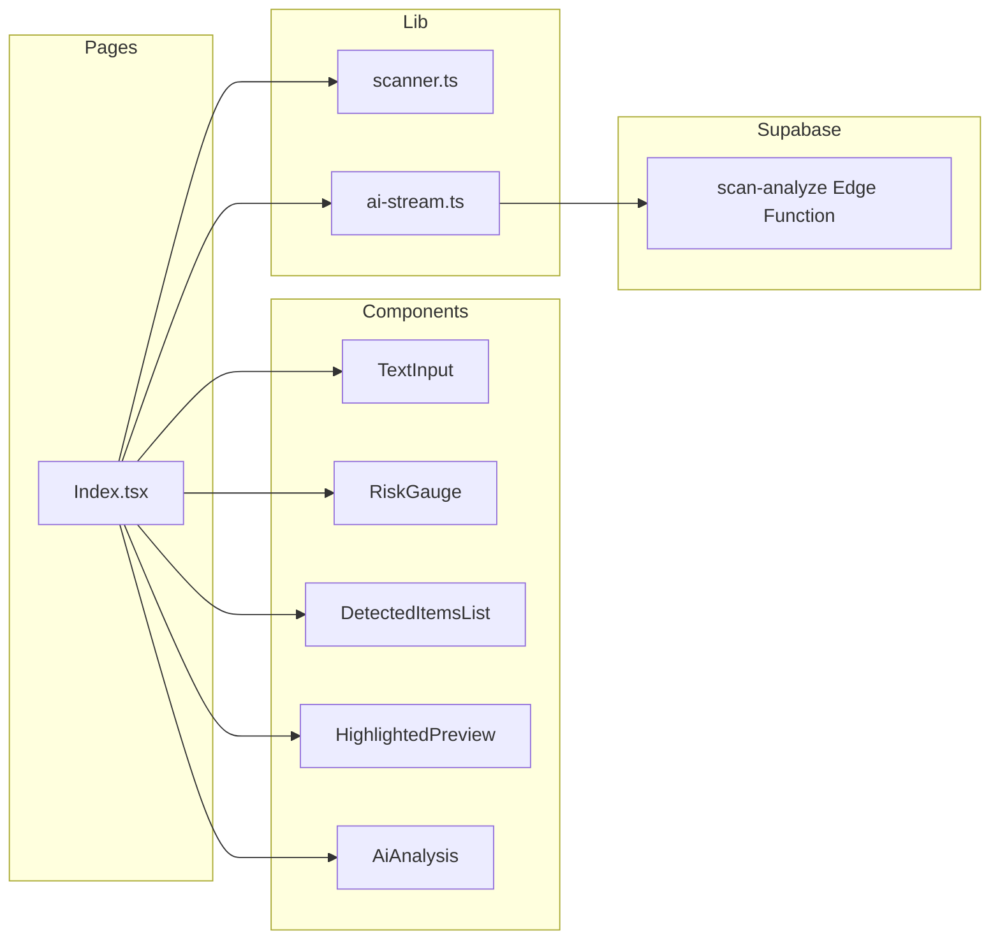
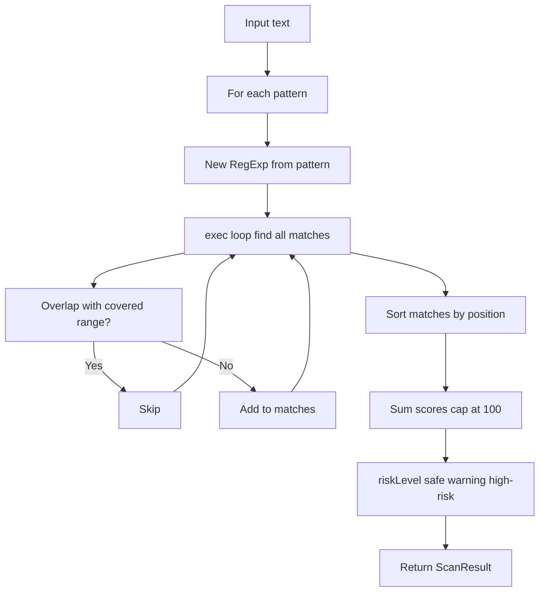
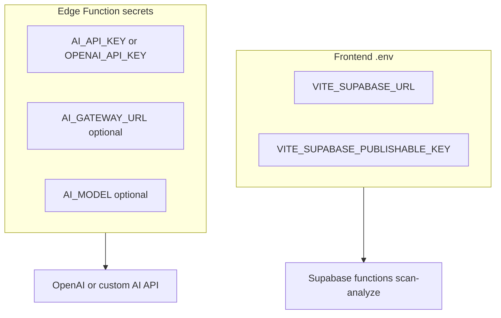

# Contextify — How It Works

**→ Open [docs/diagrams.html](diagrams.html) in your browser** to view all flowcharts rendered (Mermaid.js).  
In Cursor: right‑click `docs/diagrams.html` → **Open with Live Server** or **Reveal in File Explorer** and open in Chrome/Edge.

---

## High-level flow

## Data flow (step by step)

## Component and module map

## Scanner logic (regex pipeline)

## Environment and config

---

View at [Mermaid Live Editor](https://mermaid.live): paste each code block into the editor. GitHub and VS Code with a Mermaid extension also render these.
